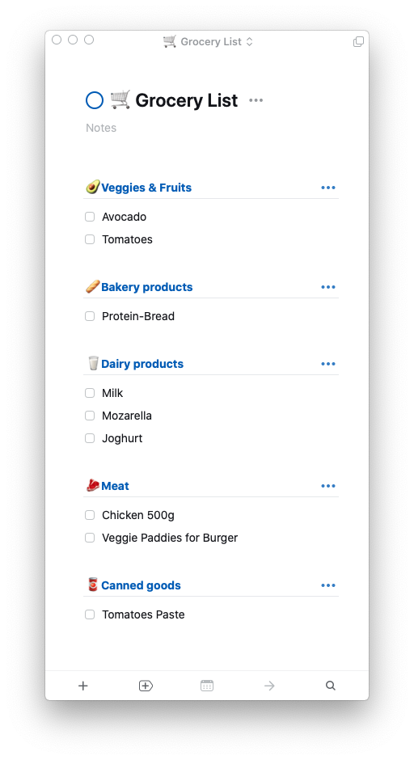

# Things3 Grocery Plugin

The aim of this project is to create a "smart" grocery list that categories the articles based on categories (vegetables, meat, milk-products,... ) but should relearn if the user changes orders. This includes also the order of the categories since supermarkets have different architecture (first vegetables then meat and so on)
Do get fast results and don't make compromise on design, the first step is a connection to a todo app (Things3).

Later on the goal could be to create the list-app as well.

For the beginning of the project to focus is on the algorithm in the background and maybe include AI.

## Goals
- try to use AI in a real project
- things3 API connection
- connection to a grocery API?

## Ideas

- Use available database as training data 
- Create roadmap of categories for supermarket profiles (future work Chang in UI) first just static with DB and static numeration

